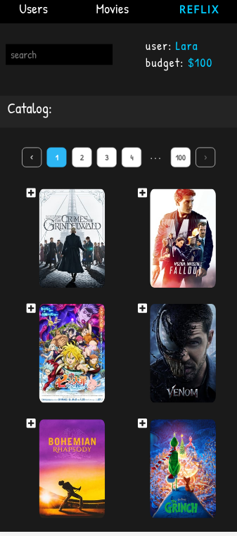

Reflix
=======

This is an OOP ReactJS project, in which you can:
1. Choose your favorite user.
2. Search for a movie of your choice from an updated movie database (an external API).
3. Read the movie's synopsis. 
4. Rent it accordingly to your budget limits.  

## Users

## Movies

The source of data for the users is a data.json, but a preparation for connection to MongoDB was made on the server-side.

Later version of this project will make it full stack using Node.js and Express.

